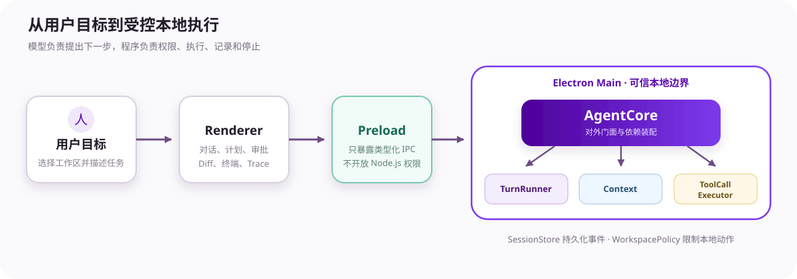
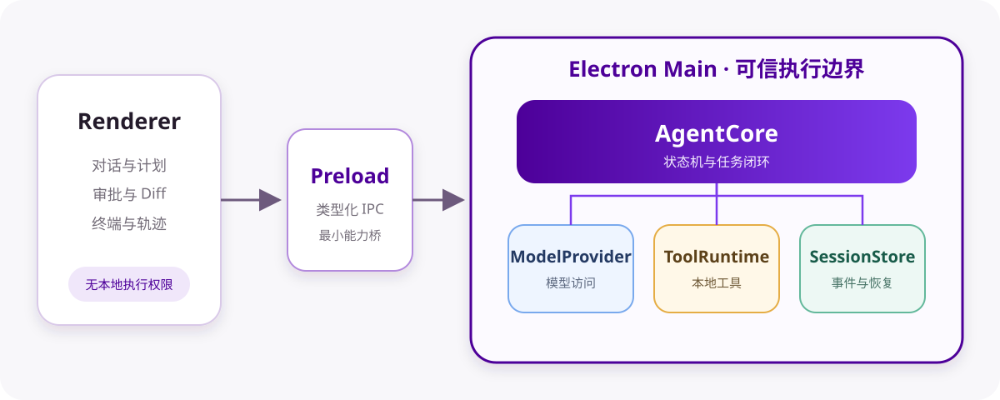
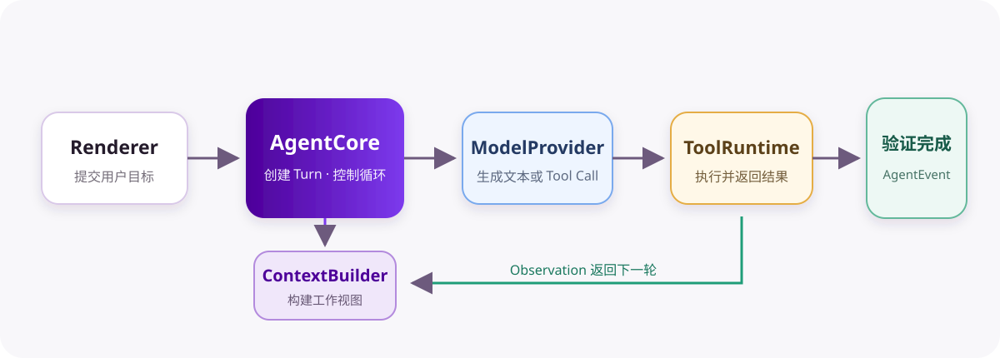
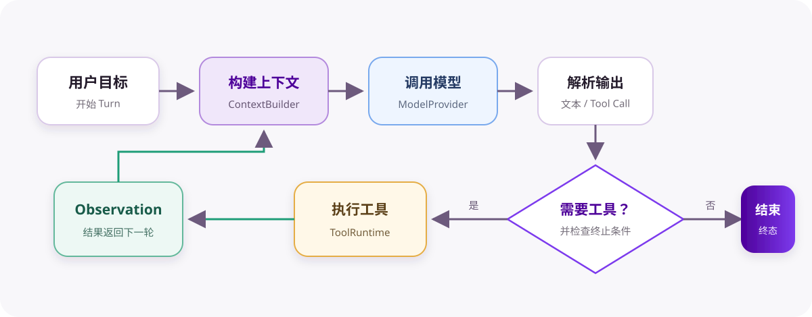
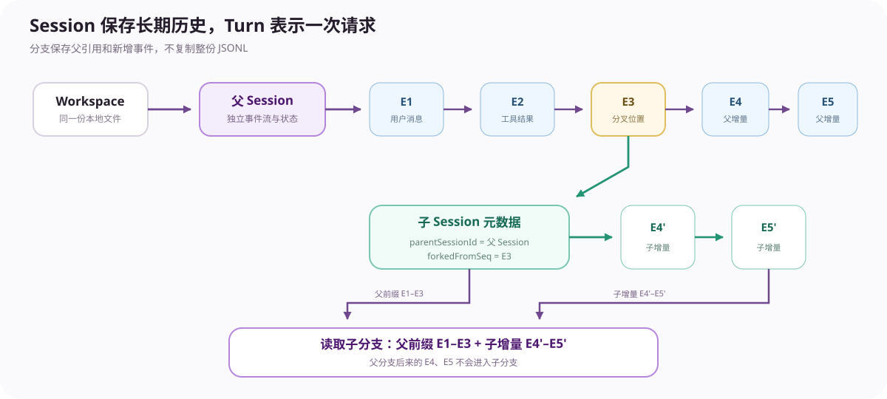
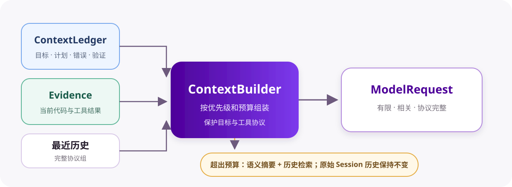
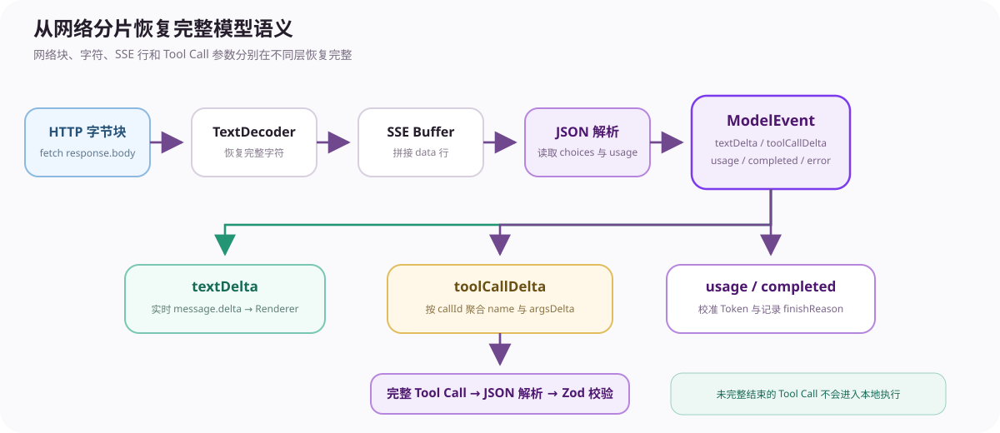
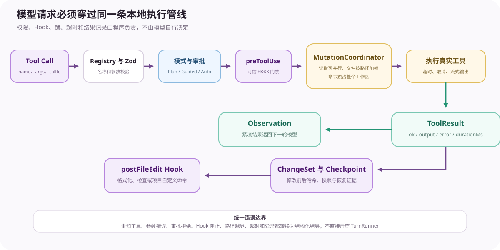
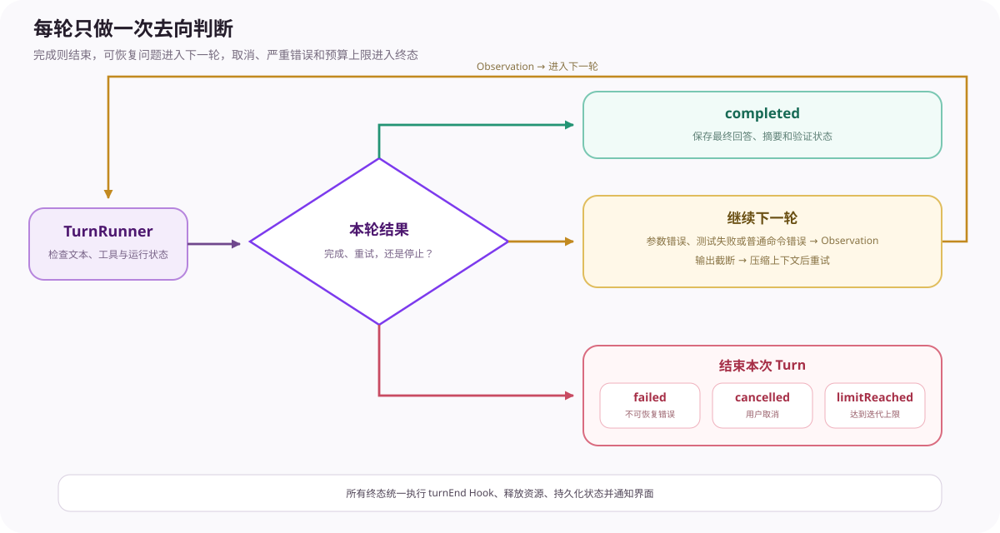

<div align="center">

# SeeCoder

**一个自行实现 Agent 核心的本地编程智能体**

理解项目、规划任务、修改文件、运行命令、验证结果，并把每一步执行展示给用户。


**代码仓库：** [https://github.com/shenhaideyu/SeeCoder](https://github.com/shenhaideyu/SeeCoder)

[快速开始](#快速开始) · [顶层架构](#顶层架构) · [核心机制](#核心机制) · [源码地图](#源码地图) · [详细文档](https://shenhaideyu.github.io/SeeCoder/)

</div>

## 简介

SeeCoder 是运行在 Windows 上的 Electron Coding Agent。用户选择本地项目并描述目标后，系统会建立一次 Turn，准备上下文，调用大模型，解析 Tool Call，在权限边界内执行本地工具，再把结果交给模型继续判断，直到任务完成或进入明确终态。

[](docs/assets/seecoder-overview.svg)

### 特色功能

- **理解项目**：浏览目录、搜索代码、读取文件并梳理项目结构。
- **完成开发任务**：制定计划、修改代码、运行命令和测试，并根据结果继续修正。
- **三种执行模式**：Plan 用于只读分析，Guided 按策略请求批准，Auto 连续执行允许的操作。
- **随时干预**：运行中可以追加要求、调整方向或取消任务。
- **安全修改**：限制工具只能操作当前工作区，支持审批、Diff、检查点和文件恢复。
- **长期会话**：保存完整历史，支持继续任务、创建分支和回退到旧位置。
- **上下文管理**：自动压缩长对话，保留关键证据、记忆和大型工具结果。
- **子 Agent 协作**：Explore 负责探索，Review 负责审查；主 Agent 统一执行写入。
- **过程可见**：实时展示模型输出、工具调用、审批、终端结果和任务轨迹。
- **模型可配置**：支持 OpenAI 兼容接口、自定义模型和加密保存 API Key。

## 快速开始

环境要求：Windows 10/11、Node.js 22.12 或更高版本、pnpm 10。

```powershell
git clone https://github.com/shenhaideyu/SeeCoder.git
cd SeeCoder
pnpm install
pnpm dev
```

首次启动时，在“设置 → 模型管理”中填写 Base URL、模型 ID 和 API Key。API Key 仅保存在环境变量或系统加密存储中。

## 顶层架构

SeeCoder 是本地模块化单体，不需要额外启动 Web 后端、数据库、Redis 或消息队列。

[](docs/assets/seecoder-system-architecture.svg)

| 层次 | 核心职责 |
| --- | --- |
| React Renderer | 展示对话、计划、工具活动、审批、Diff、终端、分支和 Trace |
| Preload | 只暴露类型化 IPC；Renderer 不拥有 Node.js 权限 |
| Electron Main | 保存模型设置，管理工作区，并承载可信的 Agent Core 与本地执行 |
| AgentCore | 对外门面和依赖装配层；不承载具体循环细节 |
| TurnRunner | 运行一次用户请求的状态机和多轮 Agent 循环 |
| ToolCallExecutor | 完成工具校验、审批、Hook、执行、结果记录和幂等控制 |
| Context | 从完整历史中选择模型本轮真正需要的信息 |
| SessionLifecycle / SessionStore | 创建、回放、分支和持久化 Session、Item 与 AgentEvent |


## 一次任务怎样完成

[](docs/assets/seecoder-task-sequence.svg)

1. Renderer 通过类型化 IPC 提交用户目标。
2. AgentCore 创建 Turn，TurnRunner 进入 `running`。
3. Context 模块组合系统规则、任务状态、代码证据、相关历史和最近消息。
4. ModelProvider 流式返回文本与 Tool Call 分片。
5. TurnRunner 保存完整 Assistant Tool Calls，再交给 ToolCallExecutor。
6. 工具结果形成结构化 ToolResult；紧凑 Observation 返回模型。
7. 模型继续读取、修改和验证，或通过自然文本、`finish` 等条件结束。
8. AgentEvent 先持久化再驱动界面，保证实时显示和重启回放使用同一事实来源。

## 核心机制

### Agent 主循环

[](docs/assets/seecoder-agent-loop.svg)

TurnRunner 每轮做六件事：检查取消和动态干预、构建上下文、调用模型、聚合输出、执行本轮工具、判断是否继续。只读探索、连续失败、输出截断和迭代预算均有独立计数，避免循环无限运行。

### Session、事件与分支

[](docs/assets/seecoder-session-history.svg)

- Workspace 是用户选择的本地项目。
- Session 是可长期追问、恢复和分支的任务容器。
- Turn 是 Session 中一次用户请求的完整执行周期。
- AgentEvent 是已经发生的事实，例如消息、工具结果、变更和终态。

事件追加写入 JSONL。Fork 和 Rewind 不复制整份历史：子 Session 只保存父 Session、分叉位置和自己的新增事件，读取时再组合父前缀与子增量。分支不会自动创建独立 Git 工作区，也不会自动恢复旧文件。

### 混合上下文管理

[](docs/assets/seecoder-context-management.svg)

完整 Session 历史用于恢复，模型每轮只接收有限工作视图：

- ContextLedger 保存目标、计划、代码 revision、验证和错误等权威事实。
- FileEvidence 按文件哈希复用仍然有效的代码片段。
- Observation 按工具类型压缩结果，避免把大型输出反复塞回模型。
- MemoryIndex 按路径、关键词、中文二元组、错误码、状态和时间召回相关历史。
- 输入达到预算阈值后，系统总结早期叙事并保留最近完整协议组；摘要失败时使用确定性回退。

压缩只改变下一次 ModelRequest，不删除原始事件。

### 模型流解析

[](docs/assets/seecoder-model-parser.svg)

ModelProvider 使用 `fetch` 接收 OpenAI 兼容 SSE。网络字节先经过 TextDecoder 和 SSE 缓冲，再转成统一 ModelEvent。Tool Call 参数可能跨多个分片到达，因此 TurnRunner 按 `callId` 聚合名称和参数；只有完整 JSON 才会进入工具 Schema 校验。

### 工具与本地执行

[](docs/assets/seecoder-tool-execution.svg)

一次 Tool Call 依次经过：工具查找、Zod 参数校验、模式与风险判断、必要审批、`preToolUse` Hook、写入协调、真实执行、结构化收尾和 `postFileEdit` Hook。

只读且声明 `parallelSafe` 的工具可以批量并行；文件写入按路径加锁，`run_command` 独占工作区，避免多个 Session 同时覆盖文件。文件修改生成 ChangeSet、Snapshot 和 Checkpoint，恢复前再次检查内容哈希。

### 终止与错误处理

[](docs/assets/seecoder-termination-errors.svg)

| 情况 | 处理方式 |
| --- | --- |
| 模型只返回完整文本 | 正常完成 Turn |
| `finish` 成功 | 保存摘要与验证状态后完成 |
| 工具参数、命令或测试失败 | 作为结构化 Observation 返回模型继续修正 |
| 模型输出达到长度上限 | 压缩上下文并重试；连续三次后失败 |
| 用户取消 | AbortSignal 中断模型、审批、子 Agent 和命令进程 |
| 不可恢复异常 | 进入 `failed` 并记录安全错误信息 |
| 达到 50 次迭代 | 进入 `limitReached`，保留已经产生的修改和证据 |

每个 Turn 只有一个终态。正常、失败和取消路径都会执行 `turnEnd` Hook，并清理活动 Turn、审批、输入等待和调用缓存。

## 其他扩展能力

| 能力 | 作用 |
| --- | --- |
| 动态干预 | Steering 在安全协议边界改变当前 Turn；Follow-up 在当前 Turn 结束后创建新 Turn |
| 只读子 Agent | Explore 和 Review 使用独立上下文；主 Agent 保持唯一写入者 |
| Hook | 在 `preToolUse`、`postFileEdit`、`turnEnd` 执行用户信任的确定性命令 |
| Interceptor | 在模型调用、文本分片和工具调用前后检查、替换或阻止内存数据 |
| Artifact | 大型工具结果外置到当前 Session，模型按引用分页读取 |
| Token 校准 | 使用 Provider 返回的真实 usage 修正本地 Token 估算 |
| 验证新鲜度 | 测试结果绑定代码 revision；再次修改后旧验证自动标记为过期 |

## 执行模式与安全边界

| 模式 | 适用场景 | 文件写入与命令 |
| --- | --- | --- |
| Plan | 理解项目、讨论方案 | 只允许读取、搜索、Diff、计划和只读子 Agent |
| Guided | 第一次使用或高风险项目 | 按策略请求用户批准 |
| Auto | 熟悉项目后的连续实现 | 自动执行允许的工作区操作，高风险动作仍受限 |

WorkspacePolicy 同时校验规范路径和符号链接真实路径，并过滤 `.env`、Token、私钥等敏感文件。当前安全机制属于应用层策略隔离，不宣称提供容器或操作系统级沙箱。

## 源码地图

```text
SeeCoder/
├── packages/
│   ├── agent-core/src/
│   │   ├── index.ts                         # Agent 门面与依赖装配
│   │   ├── context.ts                       # 上下文组织
│   │   └── runtime/
│   │       ├── turn-runner.ts               # Agent 主循环
│   │       ├── tool-call-executor.ts        # 工具调用执行
│   │       └── session-lifecycle.ts         # 会话、分支与回放
│   ├── model/src/index.ts                    # 模型请求与流式解析
│   ├── tools/src/index.ts                    # 本地工具与工作区保护
│   ├── storage/src/index.ts                  # 会话和事件持久化
│   └── protocol/src/index.ts                 # 模块共享的数据类型
└── apps/desktop/src/
    ├── main/                                 # Electron 主进程与 IPC
    └── renderer/                             # React 用户界面
```

## 验证与当前边界

```powershell
pnpm lint
pnpm typecheck
pnpm test:unit
pnpm test:integration
pnpm test:eval:unit
pnpm test:e2e
pnpm build
```

测试覆盖模型 SSE、Tool Call 聚合、Agent 循环、审批、取消、Hook、动态干预、上下文压缩、Session 分支、JSONL 回放、路径越界、补丁事务、写入锁、ChangeSet、Checkpoint、Artifact 和 Electron 核心交互。

进一步阅读：[技术文档](https://shenhaideyu.github.io/SeeCoder/)
