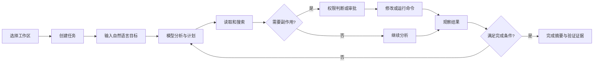

# SeeCoder 需求分析

## 1. 项目背景

考核要求独立实现一个编程智能体，使其能通过大语言模型自主读取代码、修改文件和执行命令。禁止在现有 Agent 产品上套壳，也禁止使用 LangChain、OpenAI Agents SDK、Claude Agent SDK、AutoGen、CrewAI 等 Agent 框架。对话历史、上下文、工具执行、模型解析、循环终止和错误处理必须由项目自行实现。

SeeCoder 因此不是“聊天界面加一个模型接口”，而是一个在不可信模型和本地开发环境之间建立受控执行闭环的桌面系统。

## 2. 产品目标

用户选择一个本地项目并描述编程任务后，SeeCoder 应当能够：

1. 理解任务并建立用户可见计划。
2. 搜索、读取并解释工作区代码。
3. 在权限策略允许后修改一个或多个文件。
4. 执行测试、构建或只读 Git 命令，观察结果并继续修正。
5. 在完成、失败、取消、等待用户或达到限制时展示真实状态。
6. 保存可恢复、可审计的任务轨迹，但不保存模型私有思维链。

## 3. 用户与系统角色

| 角色 | 目标 | 权限 |
| --- | --- | --- |
| 开发者 | 提交任务、查看证据、审批风险动作、撤销修改 | 决定工作区、模式和审批结果 |
| Renderer | 呈现状态与收集输入 | 无 Node.js 权限，不直接访问密钥和文件系统 |
| Electron 主进程 | 本地可信执行边界 | 管理 Agent、文件、进程、存储和系统能力 |
| 主 Agent | 规划、调用工具、验证与终止 | 唯一能够发起写入的 Agent |
| Explore 子 Agent | 定位实现与依赖 | 只读，不运行命令，不可委派 |
| Review 子 Agent | 检查 Diff、风险和测试缺口 | 只读，不修改文件 |
| 模型服务 | 生成文本和结构化工具调用 | 不直接接触本地操作系统 |

## 4. 典型用户旅程

## 5. 功能需求

| 编号 | 需求 | 验收标准 |
| --- | --- | --- |
| FR-01 | 工作区管理 | 可选择、切换并恢复最近工作区；切换时取消旧工作区任务 |
| FR-02 | Thread/Turn 会话 | 同一 Thread 可多轮追问；同一 Thread 同时只运行一个 Turn |
| FR-03 | 模型流式接入 | 支持 OpenAI 兼容 Chat Completions SSE、文本增量、工具调用和 usage |
| FR-04 | 对话历史 | 用户消息、助手消息、工具调用与结果的角色顺序正确且可恢复 |
| FR-05 | 上下文管理 | 达到窗口 70% 时压缩；保留目标、计划、变更、测试、错误及最近消息 |
| FR-06 | 本地工具 | 支持列目录、读取、批量读取、搜索、写入、补丁、命令和 Git Diff |
| FR-07 | 工具安全 | 参数经 Zod 校验；规范路径和符号链接后不得越出工作区 |
| FR-08 | 权限模式 | Plan 无副作用；Guided 逐次审批；Auto 仅自动放行策略允许的动作 |
| FR-09 | 修改可恢复 | 写入生成 ChangeSet、快照和 Checkpoint；恢复前检测外部修改冲突 |
| FR-10 | 命令执行 | 区分 stdout/stderr，支持超时、取消、进程树终止和输出上限 |
| FR-11 | 循环终止 | 正常文本、`finish`、取消、错误、截断恢复、无进展和迭代上限均明确处理 |
| FR-12 | 子 Agent | Explore/Review 独立上下文、只读、最多并发 2 个、最多 6 轮 |
| FR-13 | 用户介入 | 支持审批、`ask_user`、Follow-up、取消和计划批准 |
| FR-14 | 事件与恢复 | 新事件写 V2 Envelope；兼容读取 V1；损坏尾行不阻断其余记录 |
| FR-15 | 可观测性 | 能按 thread、turn、tool call 查看状态、耗时、token、重试和错误码 |
| FR-16 | 桌面工作台 | 对话、Changes、Files、Terminal、Preview、Trace 均由真实 IPC 驱动 |
| FR-17 | 模型设置 | 修改 model、Base URL 或 Key 后，现有 Core 不丢会话并更新 Provider |
| FR-18 | 附件 | 工作区内文本或 PNG/JPEG；单个不超过 5 MiB，每轮最多 4 个 |

## 6. 非功能需求

### 6.1 安全

- Renderer 保持 `nodeIntegration: false` 和 `contextIsolation: true`。
- 凭据明文不得进入 JSONL、日志、导出文件、Git 或文档。
- `.env`、私钥、token、credential 等敏感文件不得进入文件树和 Agent 上下文。
- 路径越界直接拒绝；危险命令不能仅依靠模型自律。
- 当前不宣称操作系统级沙箱。

### 6.2 可靠性

- 同一 `callId` 在同一 Turn 内只执行一次。
- 模型请求、命令和子 Agent 共享取消链路。
- 应用异常退出后，未终结 Turn 恢复为 `interrupted` 失败态，不能继续显示运行。
- `finishReason=length` 不是成功条件。

### 6.3 性能

- 流式 Delta 只推送实时 UI，不逐条写入 JSONL。
- 工具输出提供给模型时限制长度，完整结果保留在执行事件中。
- 文件搜索优先 `rg`，不可用时回退 Node 遍历。
- 连续探索达到第 4 轮时提醒，第 7 轮后拒绝继续只读探索。

### 6.4 可维护性

- 公共数据结构只在 `packages/protocol` 定义。
- Core 不依赖 React；Renderer 不复制 Agent 状态机。
- Model、Tools、Storage 均通过小型接口与 Core 组合。
- 不引入 Agent 框架或远程文件执行服务。

## 7. 权限模式

| 能力 | Plan | Guided | Auto |
| --- | --- | --- | --- |
| 读取、搜索、Diff | 自动 | 自动 | 自动 |
| 更新计划、提问、只读子 Agent | 自动 | 自动 | 自动 |
| 写文件、补丁 | 拒绝 | 审批 | `write_file` 路径可验证时自动；补丁仍审批 |
| 测试、构建、只读 Git | 拒绝 | 审批 | 非高风险命令按现有策略自动 |
| 安装、网络、删除、Push | 拒绝 | 审批或拒绝 | 仍需审批或拒绝 |

Plan 模式由 Core 在工具执行前强制检查，因此不是 UI 提示语。即使模型发出写入调用，也会得到结构化 `plan_read_only` 结果。

## 8. 范围排除

- 操作系统虚拟化或容器沙箱。
- 远程工作区、云同步和远程命令执行。
- MCP、第三方 Agent SDK 和远程插件市场。
- 多 Agent 并行写入和 Worktree 自动合并。
- 原生 PTY 与 Vim 等交互式 TUI。
- 服务端托管 Files API、Code Interpreter 或托管文件工具。

## 9. 需求追踪

| 重点要求 | 主要实现 | 设计文档 | 验证 |
| --- | --- | --- | --- |
| 对话历史与上下文 | AgentCore、ContextLedger、SessionStore | 08 | Core 压缩、恢复与消息链测试 |
| 工具定义与本地执行 | ToolRegistry、WorkspacePolicy、commandRunner | 09 | Tools 单元与临时仓库集成测试 |
| 模型输出解析 | OpenAICompatibleProvider | 10 | SSE 碎片和 tool-call 重组测试 |
| 循环终止 | AgentCore.runTurn | 11 | 取消、上限、截断和重复失败测试 |
| 错误处理 | ToolResult、AgentError、事件终态 | 11、12 | 单元、集成、真实 Prompt Eval |

## 10. 成功标准

首版达到“可演示”必须同时满足：真实模型完成读取、修改、测试和总结；Plan 模式不能写；取消确实停止后台；重启状态一致；所有修改可查看 Diff；自动测试通过；仓库不存在凭据。

达到“成熟系统”仍需进一步降低复杂任务的迭代数和 token 消耗。当前真实复杂轨迹已经功能完成，但 21 次模型迭代、35 次工具调用仍高于效率目标，这属于已知改进项而不是隐藏的成功指标。
