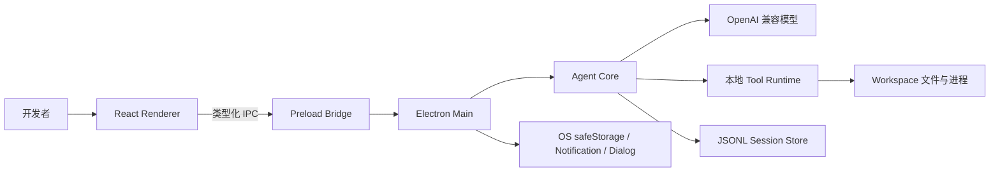
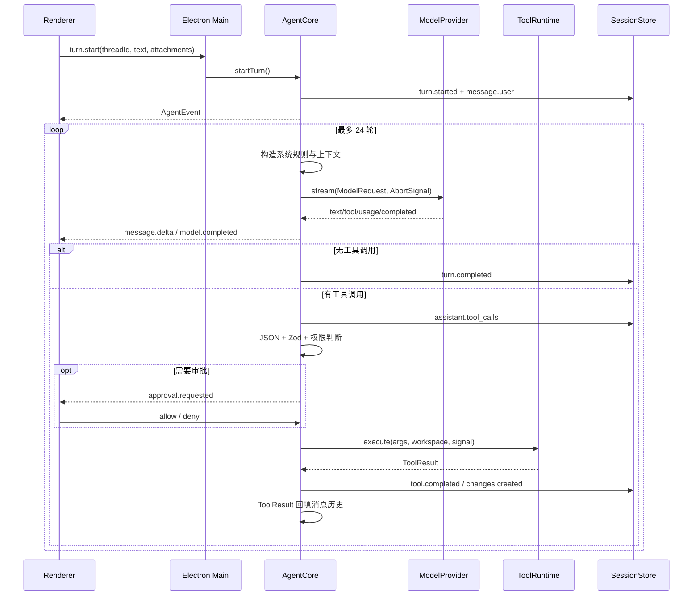

# SeeCoder 软件系统设计与架构

## 1. 架构结论

SeeCoder 采用 **Electron 模块化单体**。它有前端和后端，但后端不是远程 HTTP 服务：React Renderer 是表现层，Electron Main 是本机可信后端，二者通过 preload 暴露的类型化 IPC 通信。模型服务是唯一远程依赖。

这一结构将“用户界面”和“本地特权执行”分开，又避免为了桌面 Demo 引入独立 Web 服务、端口、鉴权、数据库和部署复杂度。

## 2. 系统上下文



## 3. 进程与信任边界

### 3.1 Renderer

Renderer 负责对话、计划、审批、Diff、文件树、终端和 Trace。它运行不可信的界面代码，因此：

- `nodeIntegration: false`：不能直接 `require('fs')` 或启动进程。
- `contextIsolation: true`：页面脚本与 preload 隔离。
- 只能调用 `window.seecoder` 中明确暴露的方法。
- 不持有 API Key，不接触任意路径文件 API。

### 3.2 Preload

Preload 是能力清单，不是业务层。每个方法映射到固定 IPC channel，例如 `turn:start`、`approval:resolve`、`files:read`。它不接受“任意 IPC 名称”，从而降低 Renderer 被注入后扩大权限的风险。

### 3.3 Main

Main 是唯一可信执行边界，负责创建和重配 Core、读取系统配置与密钥、校验 IPC 参数、管理工作区与计划任务、转发事件并记录日志。

当前 `BrowserWindow` 为兼容 Electron 38 的 ESM preload 使用 `sandbox: false`。因此 SeeCoder 只能声明 Renderer 权限隔离，不能声明 Chromium 或操作系统级完整沙箱。

## 4. 模块化单体

```text
apps/desktop
├─ src/main       本机后端、IPC、生命周期、密钥和系统集成
├─ src/preload    最小能力桥
└─ src/renderer   React 工作台

packages
├─ protocol       跨模块稳定数据契约
├─ agent-core     Agent Harness 与任务状态
├─ model          OpenAI 兼容传输和 SSE 解析
├─ tools          本地工具、安全策略与进程执行
└─ storage        JSONL、元数据、状态和快照
```

依赖方向为：

```text
protocol <- model/tools/storage
protocol + model + tools + storage <- agent-core
all packages <- desktop main
protocol <- preload/renderer
```

Core 不导入 Electron 或 React，因此可以用 Fake Provider 和临时目录独立测试。Renderer 不导入 Core，因此不会形成第二套业务状态机。

## 5. 核心数据模型

- **Thread**：可恢复的长期对话容器，绑定一个 `workspacePath`。
- **Turn**：一次从用户输入到终态的执行；同一 Thread 同时只能有一个活动 Turn。
- **Item**：进入对话历史的语义对象，如消息、工具结果和压缩摘要。
- **AgentEvent**：运行时事实，如模型请求、审批、输出和终态。
- **ChangeSet**：一次修改涉及的 before/after 内容。
- **Checkpoint**：引用 ChangeSet，并保存修改前后哈希用于冲突检测。

Item 服务上下文恢复，Event 服务 UI 和审计。二者可以在同一 JSONL 记录中共同持久化。

## 6. 一次 Turn 的端到端数据流



## 7. 事件驱动 UI

Main 使用 `webContents.send('seecoder:event', event)` 推送事实。Renderer Store 按 `threadId` 过滤事件，再派生运行阶段、待审批、计划、ChangeSet、终端输出和 Trace。

这样 UI 不需要读取 Core 内部 Map，也不会因为 React 刷新改变后端状态。代价是事件协议必须兼容，因此 V2 Envelope 显式包含 `version/id/seq/type/threadId/timestamp/payload`。

## 8. 工作区隔离

工作区不是普通筛选条件，而是安全边界：

1. 切换前调用 `core.cancelAll()`。
2. 新 Core 使用新 workspace 创建 `WorkspacePolicy`。
3. Thread 列表和历史读取验证 `workspacePath`。
4. 文件、附件、命令 cwd 和 Git 都重新进行规范路径检查。
5. Git 操作要求工作区本身就是 Git 根，避免父仓库命令影响外部文件。

## 9. 部署视图

```text
Windows 10/11
├─ SeeCoder Electron
│  ├─ Main process
│  ├─ Renderer process
│  └─ child processes: PowerShell / rg / test runner
├─ %APPDATA%/SeeCoder
│  ├─ config/settings.json
│  ├─ sessions-data/sessions/<thread>/
│  ├─ sessions-data/snapshots/<thread>/
│  └─ logs/main.log
├─ selected workspace
└─ HTTPS OpenAI-compatible endpoint
```

SeeCoder 本身不需要 Redis、消息队列或数据库。计划任务仅在应用运行时由 Main 的定时器检查。

## 10. 为什么不是独立前后端服务

独立 Node/Python 服务会新增端口生命周期、跨进程认证、CORS、服务安装和故障恢复，却不会自然增强本地文件安全。对单用户桌面 Agent，Electron Main 已经是后端，固定 IPC 比 localhost HTTP 的能力面更小。

若未来支持远程执行或多用户协作，才应将 Core 部署为独立服务；届时必须新增认证、租户隔离、队列和远程沙箱，不能直接暴露当前工具接口。

## 11. 关键限制

- `sandbox: false`，不存在 OS 级强隔离。
- JSONL 不适合多进程并发写或复杂查询。
- Main 当前承载较多 IPC 编排，继续扩展时应按领域拆分。
- Renderer 主文件偏大，是维护性问题而非运行正确性问题。
- 模型兼容性取决于具体服务对 Chat Completions tool calling 的实现质量。
