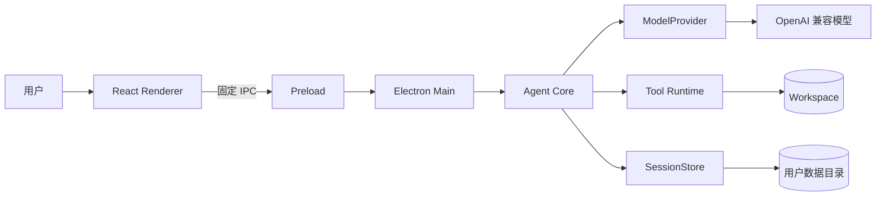

# SeeCoder 软件系统设计与架构

## 1. 架构结论

SeeCoder 采用 Electron 模块化单体。React Renderer 是前端，Electron Main 是本机可信后端，二者通过 Preload 的类型化 IPC 通信。模型 API 是唯一必需的远程服务；本地文件、命令、Session 和密钥不经过独立 Web 后端。

模块化单体表示只有一个桌面产品和一个主要可信进程，但内部仍按协议、Agent Core、模型、工具和存储拆分。它减少部署故障，同时保留清晰代码边界。

## 2. 进程与信任边界



Renderer 负责输入、页面和派生状态。窗口启用 `contextIsolation:true`、`nodeIntegration:false`。它不能直接读取文件、运行命令或取得 API Key。桌面窗口不显示 Electron 原生菜单栏，用户操作统一收敛到应用内导航、命令面板和快捷键，避免出现与 SeeCoder 页面重复且低价值的“文件 / 编辑 / 视图 / 帮助”入口。

Preload 只暴露 `window.seecoder` 下的固定方法。它不是业务层，也不提供通用 `invoke`、任意文件或任意命令接口。

Main 是可信边界，负责工作区、设置、系统安全存储、IPC 校验、日志、计划任务和 Agent Core 装配。当前因 ESM preload 兼容使用 `sandbox:false`，因此安全能力来自最小 IPC、工具策略和审批，而不是 Chromium 完整沙箱。

## 3. 模块职责

| 模块 | 负责 | 不负责 |
|---|---|---|
| Protocol | 公共数据结构和事件契约 | 执行逻辑 |
| Agent Core | Turn 状态机、上下文、工具调度、终止 | HTTP 和具体文件实现 |
| Model | 请求序列化、SSE、重试和取消 | 权限和任务完成判断 |
| Tools | 路径策略、文件、补丁、命令和 Git | Session 与 UI |
| Storage | JSONL、元数据、Ledger、Snapshot 和回放 | 调用模型或工具 |
| Renderer | 交互、任务列表、审批、Diff、终端和 Trace | 可信业务状态 |

边界的判断方法是看控制权。ModelProvider 可以报告 Tool Call，但不能执行；Tools 可以修改文件，但不能决定继续调用模型；Renderer 可以请求取消，但只有 Core 发布终态后才能确认任务已取消。

## 4. 核心数据模型

Workspace 是本地项目目录。Session 是一条长期任务对话。Turn 是 Session 中一次用户请求到终态的执行。Item 是需要持久保存的业务事实，例如用户消息、Assistant Tool Calls、Tool Result 和 ChangeSet。AgentEvent 是实时或可回放的状态变化。

```text
Workspace
└─ Session
   ├─ Turn 1
   │  ├─ Items
   │  └─ Events
   └─ Turn 2
```

Session 和 Turn 分开后，用户可以长期追问，但每次执行仍有独立状态、取消信号、迭代数和终态。

## 5. 一次任务的数据流

用户点击发送后，Renderer 调用 `turn.start`。Main 校验参数并调用 Core。Core 保存用户 Item、建立 Turn 和 AbortController，再进入主循环。ContextBuilder 从 Session 的消息、Ledger、Evidence 和 Memory 构建模型输入。Provider 流式返回文本和 Tool Call。

有 Tool Call 时，Core 先持久化完整 Assistant Tool Calls，再校验工具、参数、权限和 Hook。工具输出通过事件实时发送，最终 Tool Result 使用相同 `callId` 写回消息。模型在下一轮看到 Observation 并继续决策。终态事件先持久化再广播，流式文本增量除外。

## 6. 事件驱动 UI

Renderer 的 Agent 状态由 AgentEvent 驱动，不读取 Core 内部 Map。事件显式携带 `sessionId`，Turn 事件携带 `turnId`，工具事件携带 `callId`。快速切换 Session 时，Renderer 使用加载 token 丢弃过期异步结果。

这种设计避免前端显示 running 而后台已经失败，也允许重启后用同一事件 reducer 恢复页面。UI 状态可以重新计算，业务事实不能由 UI 猜测。

## 7. 数据与部署

生产数据位于 Electron 用户数据目录：

```text
sessions-data/sessions/<session-id>/meta.json
sessions-data/sessions/<session-id>/state.json
sessions-data/sessions/<session-id>/events.jsonl
sessions-data/snapshots/<session-id>/<change-set-id>/
logs/main.log
```

SeeCoder 不需要数据库、Redis、远程 Queue 或 WebSocket。Renderer 与 Main 使用 Electron IPC，模型响应使用 HTTPS/SSE。本地命令按需启动受控 PowerShell 子进程。

## 8. 为什么选择该架构

浏览器加本地 HTTP 服务会引入端口、鉴权和服务生命周期；纯 CLI 难以展示审批、Diff 和 Trace；微服务不适合单用户本地应用。Electron 同时提供本机后端和成熟 UI 生态，代价是安装体积与内存较大。

JSONL 适合单主进程追加事件，透明且易审计；SQLite 查询和多进程能力更强，但当前规模不需要其迁移和打包成本。若未来进入多用户远程执行，应重新设计独立服务、数据库、队列和 OS 沙箱，而不是继续扩大 Main。

## 9. 当前限制

当前没有 OS 级沙箱、远程执行、跨设备同步和多写者 Worktree 调度。Session 隔离上下文，不隔离同一 Workspace 中的文件。Fork 复制对话事件，不复制项目、Git 分支和 Snapshot。未完成 Turn 重启后标记为 interrupted，不会自动续接旧网络和子进程。

## 10. 一次请求经过哪些接口

Renderer 的 `send` 读取输入框、当前 Session、附件和 Skill。若已有 Turn 运行，它调用 `turn.followUp`；否则调用 `turn.start(sessionId, text, attachments, skillId)`。Preload 将调用映射到固定 IPC channel，Main 检查字符串长度、枚举和当前 Workspace，再调用 `AgentCore.startTurn`。

Core 在返回 Turn ID 前保存用户消息并发布 `turn.started`。真正的循环异步运行，因此 UI 不需要等待整项任务结束。之后模型和工具状态通过事件订阅持续到达。这个结构允许用户取消、审批或继续输入，也避免一个长任务阻塞 IPC handler。

```text
同步返回：创建是否成功、turnId 是什么
异步事件：模型、工具、审批、Diff、终端和最终状态
```

## 11. 状态分别由谁拥有

Core 拥有业务状态：Turn 状态、活动请求、审批、消息、Ledger、Evidence、ChangeSet 和 Checkpoint。Main 拥有应用状态：当前 Workspace、模型配置、API Key、窗口和计划任务。Renderer 只拥有界面状态：选中的 Session、打开的面板、输入框、折叠状态和由事件派生的展示数据。

把状态放错位置会产生典型问题。如果 Renderer 自行维护 Turn 状态，刷新后可能和后台不一致；如果 ModelProvider保存 Session，它会把网络协议和业务状态耦合；如果 Tools 决定完成，测试命令就可能越权改变主循环。

## 12. Workspace 切换

切换 Workspace 不是简单修改一个路径字符串。Main 先取消旧 Core 的活动任务，再保存最近工作区，使用新路径重新创建 WorkspacePolicy、ToolRegistry 和 Agent Core。Renderer 清空旧项目派生状态，重新列出只属于新 Workspace 的 Session。

Core 在列出、加载、读取历史和删除 Session 时都比较 `workspacePath`。这使已知其他 Session ID 的页面也不能跨工作区读取历史。Windows 路径比较需要规范化并忽略大小写。

## 13. 模型配置怎样生效

模型配置包括 Base URL、模型名、context window、temperature 和最大输出。切换模型时 Main 重建 ModelProvider 或更新 Core 使用的 Provider，但不删除 SessionStore 中的历史。API Key 在 Main 内存或 safeStorage 解密后使用，不通过 Renderer 消息进入模型请求。

Context window 是用户对兼容模型能力的配置，不由 Provider 自动猜测。ContextBuilder 根据它计算预算；配置错误可能导致服务端拒绝或压缩过早，因此设置页需要清晰展示当前模型与供应商。

## 14. 控制流和数据流的区别

控制流表示“谁决定下一步”。用户通过 Renderer 发出任务，Core 决定进入哪一轮、是否执行工具和何时终止。ModelProvider 和 Tools 都是被 Core 调用的组件，不能反向控制主循环。

数据流表示“信息怎样移动”。用户消息从 Renderer 进入 Session；ContextBuilder 将部分历史变成 ModelRequest；模型输出变成 ModelEvent；工具输出变成 ToolResult 和 Observation；AgentEvent 又回到 Renderer 与 Storage。控制流集中在 Core，数据则在多个模块间通过 Protocol 类型传递。

区分两者有助于定位问题。模型返回内容正确但文件没有改变，通常是工具控制流或权限问题；文件已改变但 UI 没显示，通常是 Event 数据流问题；下一轮模型看不到工具结果，通常是 ModelMessage 组装问题。

## 15. Protocol 为什么单独成包

Main、Core、Model、Tools、Storage 和 Renderer 都需要理解 Session、Turn、Tool Call 和 Event。如果每个模块自行定义相似对象，就会出现同一字段使用不同名称、状态集合不一致，或 UI 展示后台并不存在的状态，最终使协议迁移和状态恢复变得困难。

Protocol 包只声明数据契约，不依赖 Electron 和具体实现。它使 TypeScript 能在编译期发现跨层变化。运行时不可信输入仍需要 Zod 或 Main 参数检查，因为 TypeScript 类型不会存在于用户输入和网络 JSON 中。

公共类型也形成架构约束。Renderer 可以消费 AgentEvent，却不能导入 Core 的私有 Map；ModelProvider接收 ModelRequest，却不需要理解 ChangeSet；Tools 返回 ToolResult，却不知道 SessionStore。模块只共享必要协议。

## 16. 事件为什么既用于 UI 又用于恢复

Core 内存中的对象适合运行，但进程退出后会消失。AgentEvent 把重要状态变化转换成可以持久化的事实。实时运行时，Main 将事件广播给 Renderer；重启时，Storage 读取同一类事件并交给 reducer 回放。

不是所有 UI 更新都需要永久保存。`message.delta` 只服务流式显示，如果每个 token 都写 JSONL，会产生大量记录；模型完成后保存完整 Assistant Message 即可。相反，Tool Calls、Tool Result、ChangeSet 和终态必须持久化，否则无法恢复合法消息链与执行证据。

事件驱动不等于完整 Event Sourcing。SeeCoder 还使用 `state.json` 保存 Ledger 快照，减少恢复成本；Snapshot 保存文件正文。这里采用的是“追加事件 + 权威状态快照”的组合，而不是强制所有状态都从事件推导。

## 17. Main 为什么不能成为巨型业务模块

Main 拥有高权限，容易不断加入 IPC、文件和配置逻辑。如果 Agent 循环也直接写在 Main 中，窗口生命周期、模型协议、工具策略和状态机会耦合，既难测试也难替换。

当前 Main 负责装配与可信边界：创建 Provider、Store 和 Core，注册 IPC，管理 Workspace、设置、密钥和窗口。Agent 决策留在 Core，文件实现留在 Tools，事件文件留在 Storage。这样单元测试可以在没有 Electron 的情况下直接运行 Core。

模块化单体的目标不是追求文件数量，而是保持依赖方向。Renderer → IPC → Main → Core → Model/Tools/Storage 是主方向；底层模块不能反向依赖 Renderer。

## 18. 故障怎样跨模块传播

模型网络错误先由 Provider 转成稳定 ModelEvent error。Core 判断有限重试已经结束后创建 AgentRunError，并发布 `turn.failed`。Renderer 将错误映射成用户可理解卡片，Storage 保存终态，Main 日志记录错误码和耗时。

工具错误则不同。Tools 返回 `ok:false` 的 ToolResult，Core通常把它作为 Observation 加入消息，Turn 保持 running。只有重复无进展或内部状态损坏才升级为 Turn 失败。由 Core 统一决定错误层级，可以避免 Model 和 Tools 各自用不同规则终止任务。

Renderer 发生展示错误不能改变 Core 状态。即使右侧 Trace 渲染失败，后台 Turn 仍按 Core 规则运行；全局前端错误处理应提示用户，而不是发送额外副作用。

## 19. 架构演进边界

若未来增加远程执行，Main 不应直接连接任意远端 Shell。合理方向是增加明确 RemoteExecutor 接口和隔离服务，服务端负责身份、队列和沙箱，Core 仍只看 ToolResult。若增加 Anthropic 原生协议，应实现新的 ModelProvider，不改变 Agent Loop。

若 Session 查询规模扩大，可以把 SessionStore 替换为 SQLite，但事件信封和 replay reducer 可以保留。若增加向量检索，应作为新的 Context Source，不能替代 Ledger 和消息协议保护。

这些演进方式体现当前边界的价值：可替换基础设施，而不重写任务状态机。首版没有提前创建全部抽象，只在已有明确边界处保留接口。
