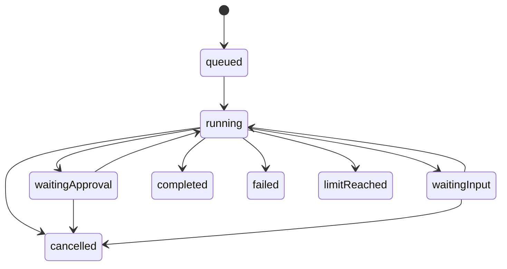
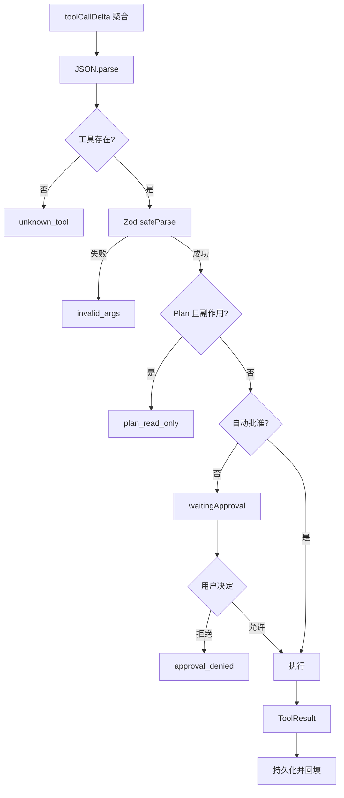

# SeeCoder Agent Core 详细设计

## 1. Harness 的职责

Agent Core 是模型与本地工具之间的控制器。模型负责提出下一步，Core 负责判断是否合法、是否需要用户介入、如何执行、如何反馈，以及何时必须停止。LLM 不是进程调度器或权限系统；若直接执行其文本，参数、幂等、取消、恢复和终态都无法保证。

## 2. 核心内存结构

| 结构 | Key | 作用 |
| --- | --- | --- |
| `messages` | threadId | 角色化模型历史 |
| `threads` / `turns` | id | 会话与执行状态 |
| `activeThreadTurns` | threadId | 单 Thread 单活动 Turn |
| `controllers` | turnId | 取消模型和工具 |
| `approvals` / `pendingInputs` | request id | 异步等待用户 |
| `executedCalls` | turnId/callId | 副作用幂等 |
| `children` | childId | 子 Agent 取消与并发 |
| `changeSets` / `checkpoints` | id | 修改与恢复 |
| `followUps` | turnId | 下一轮注入追加要求 |
| `turnModes` | turnId | 固定本轮权限 |
| `ledgers` | threadId | 结构化工作记忆 |

## 3. 状态模型

持久化 Turn 状态是 `queued/running/waitingApproval/waitingInput/completed/failed/cancelled/limitReached`。模型请求、工具执行和 Review 是 `running` 内部阶段，由 UI `RunPhase` 呈现，避免状态组合爆炸。



## 4. Turn 启动

`startTurn` 加载 Thread、拒绝同 Thread 第二个活动 Turn、绑定模式、校验附件、写入用户目标和 Ledger，然后持久化 `turn.started/message.user`，最后异步运行 Core。文本附件最多 40,000 字符，图片转 data URL，每轮最多 4 个。

## 5. 主循环

```text
for iteration = 1..24
  检查取消
  注入 Follow-up
  必要时注入探索收敛提示
  根据预算压缩上下文
  发送流式模型请求
  聚合文本、tool call、usage、retry 和 finish reason
  保存完整 assistant 消息或 assistant.tool_calls
  若 length：压缩并恢复，不得完成
  若没有工具：完成
  对每个工具：解析 -> schema -> 模式 -> 审批 -> 执行 -> 回填
  若 finish 成功：完成
  更新无进展和探索预算
end
未完成则 limitReached
```

每个工具调用必须形成相邻的 `assistant(tool_calls=[id])` 与 `tool(tool_call_id=id)`。先保存 Assistant Tool Calls 再执行，是兼容 Chat Completions 和会话恢复的必要条件。

## 6. 探索收敛

- 连续 4 个只读迭代后注入一次提醒。
- 连续 7 个只读迭代后继续读取返回 `exploration_budget_exhausted`。
- `set_plan`、`compact_context`、`checkpoint` 不重置计数。
- 写入或执行验证会重置计数。

不用复杂收益预测器，是因为其判断仍依赖模型且难以稳定测试。硬预算粗糙但可解释、可复现，能阻断无限探索。

## 7. 工具生命周期



`executedCalls` 的作用域是 Turn。相同 `callId` 再次出现时返回已有结果，不重放副作用；Turn 结束后清理，避免跨 Turn 串线。

## 8. 权限模式

- **Plan**：Core 拒绝所有 `sideEffect` 工具。
- **Guided**：副作用进入 `waitingApproval`。
- **Auto**：工作区写入和策略认可的非高风险命令自动执行。

用户拒绝会生成 `approval_denied` ToolResult，而不是破坏整个 Turn，因此模型可以改换只读方案。

## 9. 子 Agent 与 Review

子 Agent 使用独立消息数组，最多 6 轮，只注册 `list_files/read_file/search_text/git_diff`。Core 再验证白名单和副作用；因为没有 `delegate`，结构上不可嵌套。全局最多并发 2 个，父 Turn 取消会中止子控制器。

`review_changes` 启动只读 Review 子 Agent并产生 finding 事件。当前只把总摘要映射为低严重度 Finding，尚不等同于成熟静态分析器的多条行级缺陷抽取。

## 10. ChangeSet 与 Checkpoint

写工具返回 `{ kind: 'changes', files }` 后，Core 创建 ChangeSet、更新 Ledger、保存修改前快照并创建含 beforeHash/afterHash 的 Checkpoint。恢复前比较当前内容与 `afterHash`；若用户已修改文件则返回 `checkpoint_conflict`。

## 11. Follow-up 与 ask_user

Follow-up 不打断当前工具，而是在下一次模型请求前按 FIFO 注入，避免破坏工具消息配对。`ask_user` 使用 Promise 暂停而非轮询；回答或取消后恢复，并把答案作为 ToolResult 交还模型。

## 12. 终止保证

正常无工具结束、`finish`、取消、模型错误、连续失败、连续三次输出截断、24 轮上限和应用中断都进入明确终态。`finally` 清理控制器、活动 Turn、模式、幂等缓存和未决审批。

## 13. 设计收益与代价

| 设计 | 收益 | 代价 |
| --- | --- | --- |
| 自研显式循环 | 可解释、可测、符合考核 | 需自行处理协议边界 |
| 单 Thread 单 Turn | 状态清晰、无同会话写冲突 | 不支持同任务并行执行 |
| 主 Agent 单写者 | 回滚与责任简单 | 子 Agent 不能直接修改 |
| 硬探索预算 | 确定停止重复读取 | 大项目可能过早收敛 |
| Event + Item | UI 审计与上下文各司其职 | 协议维护成本更高 |

## 14. 当前限制

- 只加载工作区根 `AGENTS.md`，未实现子目录逐层规则。
- 压缩不保证严格降至上下文窗口 55%。
- Review Finding 粒度有限。
- 复杂任务 token 消耗仍需通过更多真实任务校准。
